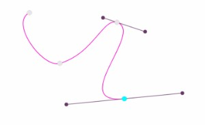

# Bezier Canvas

[1. Introduction](#1-introduction)<br/>
[2. Compilation process](#2-compilation-process)<br/>
[3. Loading the library](#3-loading-the-library)<br/>
[4. Usage](#4-usage)<br/>
[5. Options](#5-options)<br/>
[6. Public API](#6-public-api)<br/>
[7. License](#7-license)<br/>
[8. Author](#8-author)<br/>

## 1. Introduction
Bezier Canvas library transforms any HTML5 canvas into a Bezier drawing surface.
With 2 distinct drawing modes, you will be able to draw 'natural'
splines like with the Photoshop pencil tool, or, to draw
pure Bezier splines the classical way with the default mode.

Moreover, you will also be able to export the current spline and import it back later using a JSON format.

Finally the public API lets you walk along the spline and put shapes (or anything you wish) at regular distanced positions.


## 2. Compilation process
Written in Typescript and packaged with Webpack, the library is delivered with a ready to use javascript file.
However, you could want to make changes and build it again.

First of all you will need to install [the NodeJS Framework](https://nodejs.org/en/). Then, you will need to install
required dependencies by running the following instructions :

```bash
# Navigate to the library directory
cd bezier-canvas

# Installing dependencies
npm install
```

Then to trigger the build process :
```bash
npm run-script build
```


## 3. Loading the library

The library is packed using the "Universal Module Definition" scheme. You can then include it into various javascript contexts :

* Vanilla JS
```html
<!doctype html>
<head>...
<script type="text/javascript" src="dist/bezier-canvas.min.js"></script>
...
<body>
...
<script type="text/javascript">
// You then have access to a global object BezierCanvas
// (See below the usage section to learn how to use it)
</script>
</body>
...
```

* Require JS
```html
<!doctype html>
<head>...
<script type="text/javascript" src="https://cdnjs.cloudflare.com/ajax/libs/require.js/2.3.5/require.js"></script>
...
<body>
...
<script type="text/javascript">
requirejs.config({
    baseUrl: './dist',
    paths: {
        BezierCanvas: 'bezier-canvas.min'
    }
});
require(['BezierCanvas'], (BezierCanvas) => {
// You then have access to BezierCanvas object
// (See below the usage section to learn how to use it)
});
</script>
</body>
```

* Node JS module definition way
```js
const BezierCanvas = require('BezierCanvas');

// You then have access to BezierCanvas object
// (See below the usage section to learn how to use it)
```


## 4. Usage

Once you have loaded the library, attaching the component to a canvas is as simple as the following code :

```javascript
const canvas = document.getElementById('mycanvas');
const options = {}; // See Options section to know available options
const myBezierCanvas = new BezierCanvas(canvas, options);
const paint = () => { // Refresh the canvas when possible
    myBezierCanvas.paint();
    requestAnimationFrame(paint);
}
requestAnimationFrame(paint);
```


## 5. Options

Following options are available to custom the component :

```javascript
const opts = {
     historySize: 50, // How many steps back are tracked
     naturalDrawMode: true, // true for a Photoshop pencil tool way, false for default Bezier
     maxDistance: 10, // Max distance to a point to consider it hovered
     smoothFactor: 0.5, // Smooth factor to change the computed curvature smoothness when adding new construction points
     constraintTangents: true, // Should the control points be aligned on the same axis

     constructionPointSize: 6, // Construction points size
     constructionPointBorderSize: 1, // Construction points border size
     constructionPointBorderColor: 'rgb(150, 150, 150)', // Construction points border color
     constructionPointFillColor: 'rgb(230, 230, 230)', // Construction points background fill color
     constructionPointActiveFillColor: 'cyan', // Background fill color of construction points while being selected
     constructionPointActiveBorderColor: 'rgb(100, 120, 255)', // Border Color of construction pointS while being selected
     constructionPointShape: 'disc',  // or 'square' : Shape of construction points


     controlPointSize: 4, // Control points size
     controlPointBorderSize: 1, // Control points border size
     controlPointBorderColor: 'rgb(120, 120, 120)',  // Control points border color
     controlPointFillColor: 'rgb(180, 180, 180)', // Control points background fill color
     controlPointActiveFillColor: 'cyan', // Background fill color of control points while being selected
     controlPointActiveBorderColor: 'rgb(100, 120, 255)', // Border Color of control points while being selected
     controlPointShape: 'disc',  // or 'square' : Shape of control points

     tangentColor: 'rgb(150, 150, 150)', // Color of tangents
     tangentThickness: 2, // Thickness of tangents

     lineCap: LineCap.Round, // 'round' or 'square' or 'butt'
     splineColor: 'rgb(0,0,200)', // Color of the Bezier spline
     splineThickness: 5, // Thickness of the Bezier spline
     showMaxNextAndPreviousTangents: 1 // How many tangents before and after the active point to show at maximum, set -1 to show all
 };
````

Here are some examples of what you can obtain with different options sets :




Then to draw a spline : 

- Left click to add a construction point (moving the mouse will change handler points position)
- Right click to remove a construction point
- Maintain CTRL key and move mouse to move a construction/handler point
- Press Ctrl + Z to cancel last action, Ctrl + Y to restore it


### 6. Public API

#### 6.1 Pre-configuring points
The library allows to set pre-existing points, for example, to import
a previous state, the following instructions describe how to use it.

```javascript
const myBezierCanvas = new bezierCanvas(myCanvasElement);

myBezierCanvas.setPoints([
    {x: 423, y: 130, hp1: {x: 423, y: 426}, hp2: {x: 300, y: 460}},
    {x: 390, y: 300, hp1: {x: 602, y: 180}, hp2: {x: 570, y: 127}},
    ...
]);

**OR by setting the "points" key of the options object :**

const myBezierCanvas = new CanvasBezierHandler(canvas, {
...
    points: [
            {x: 423, y: 130, hp1: {x: 423, y: 426}, hp2: {x: 300, y: 460}},
            {x: 390, y: 300, hp1: {x: 602, y: 180}, hp2: {x: 570, y: 127}},
            ...
        ]
});

```

#### 6.2 Fetching all the existing points

```javascript
const myBezierCanvas = new CanvasBezierHandler(canvas);
const points = myBezierCanvas.getPoints();
/* 
* points will contain an array similar to : 
* [
*   {x: 423, y: 130, hp1: {x: 423, y: 426}, hp2: {x: 300, y: 460}},
*   {x: 390, y: 300, hp1: {x: 602, y: 180}, hp2: {x: 570, y: 127}},
*   ...
* ]
*/

```

#### 6.3 Getting equally distanced points along the current spline
It can be use for example to draw shapes along the spline form the outside.

```javascript
const shapesToDraw = 50; // Count of shapes to draw
const myBezierCanvas = new CanvasBezierHandler(myCanvas);
const points = myBezierCanvas.getRegularlyPlacedPoints(shapesToDraw);

// Then we can do something like
points.forEach((point) => {
  drawSomethingAtPosition(point.x, point.y);
});
```

This would for example producing a similar figure :


#### 6.4 Resetting the component

```javascript
const myBezierCanvas = new myBezierCanvas(canvas);
myBezierCanvas.reset();
// This will erase all the existing points and clear the canvas
```


#### 6.5 Dynamically show/hide spline
For example, if all you need is to retrieve regular positioned points, you may want to hide the spline.

```javascript
const myBezierCanvas = new CanvasBezierHandler(canvas);
myButtonHide.onclick = () => { myBezierCanvas.hideSplines(); };
myButtonShow.onclick = () => { myBezierCanvas.showSplines(); };
```

## 7. License
You can find all the license information inside the LICENSE.md file

## 8. Author
Bilel OURAL - bilel.oural@b-stud.com
